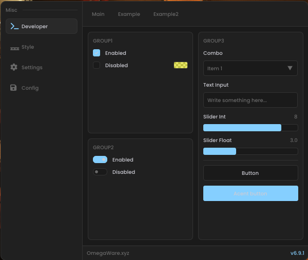
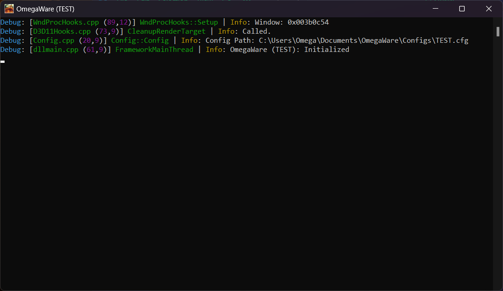

<div align="center">

# Payday3-Internal-V2


[](https://github.com/Matt-T-123/Payday3-Internal_v2/stargazers)
[](LICENSE)
[](https://github.com/Matt-T-123/Payday3-Internal_v2/actions)
[](https://github.com/Matt-T-123/Payday3-Internal_v2/issues)

</div>

---

## 📸 Screenshots

<div align="center">

### Menu Interface


### Developer Console


</div>

---

## 🎯 Features

- **Aimbot**: abc

---

---

## Todo:

- **Aimbot**
- **ESP**
- **Gun mods**

## ⚙️ Framework

It is completely based off of Omega172's repos "Payday3-Internal" and "OmegaWare-Framework". 
It was simply refactored to use his framework to make future development easier.

You can find them here:
[Payday3-Internal](https://github.com/Omega172/Payday3-Internal)
[OmegaWare-Framework](https://github.com/Omega172/OmegaWare-Framework)

---

## 🚀 How to Build

This project is built using [Xmake](https://github.com/xmake-io/xmake). Use the [VS Code extension](https://marketplace.visualstudio.com/items?itemName=tboox.xmake-vscode) for the best experience.

### Install Requirements
- **Xmake**: Follow instructions at [xmake.io](https://xmake.io/guide/quick-start.html#installation)

### Clone Repository

```bash
git clone https://github.com/Matt-T-123/Payday3-Internal_v2.git
cd Payday3-Internal_v2
```

### Build Commands

```bash
# Configure build mode
xmake config -m <debug|release> -a x64 -p windows

# Build project
xmake build

# Or use VS Code tasks (Ctrl+Shift+B)
# - xmake: Build (Debug)
# - xmake: Build (Release)
```

### Optional: Generate Visual Studio Project

```bash
xmake project -k vsxmake2022 -m "debug;release"
```

> **Note**: x86 and ARM builds are not officially supported and may require modifications.

---

## 📝 License

This project is licensed under the terms specified in [LICENSE](LICENSE).

## 🤝 Contributing

Contributions are welcome! Please feel free to submit issues and pull requests.

## ⭐ Support

If you find this project useful, consider giving it a star!
